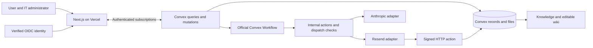

# Architecture and engineering decisions

Harbor is a new TypeScript implementation using Next.js on Vercel and Convex as the primary backend. The requested direction was informed by Town's vendor disclosures. Town's internal architecture has not been independently established here; every implementation choice below is Harbor's own.

## Boundaries

Queries read authorized state; mutations validate and change database state atomically; actions call external services; HTTP actions verify provider callbacks. User input never chooses an arbitrary owner or bypasses membership checks. Background actions carry persisted workspace/owner references and check them again before dispatch. Personal records remain owner-scoped even for workspace administrators.

The browser subscribes to task, conversation, wiki, approval-containing task detail, policy and routine queries. It has no model credentials. The UI's fictional demo is a separate client-only route and is never inserted into live workspaces.

## Durable work and external effects

The official Convex Workflow component journals steps and approval events. Harbor's records carry business state, deadlines, reservations, recovery count, intent and provider identifiers. A DB transaction cannot make an HTTP side effect exactly once. Every email has an intent before dispatch, an idempotency key, and a distinct uncertain state if the result cannot be established. Retrying a workflow does not grant permission to resubmit an uncertain action.

## Context, personality and knowledge

Agent preferences are subordinate instructions. They cannot change permissions or approval rules. Knowledge stores entities and source references independently of wiki prose; approved facts carry timestamps, confidence and review state. Entity revisions and current source permissions follow context into generated tasks and messages. Identity matches are reviewed links, not destructive name-based merges.

Structured indexes and owner/workspace-filtered full-text search are implemented. Vector indexing is deferred until an embedding adapter, dimensionality, cost, refresh and deletion path are selected. Incremental external-source retrieval and model extraction remain separate work items. No source account is silently imported.

## Providers and routing

Anthropic is the initial text provider. A typed adapter boundary separates model invocation from routing, budgeting and persistence. Model identifiers and prices are configurable server-side. Capability/context/provider/model/cost restrictions are checked before dispatch. Configured quality/latency labels are not measured evaluations; a future evaluation pipeline must supply measured task quality before automatic quality-based routing is claimed.

Core Google/Microsoft mail/calendar integrations will use direct provider APIs. Pipedream is evaluated for additional OAuth integrations, Resend for application email, and E2B for isolated code execution. Only the implemented adapters in providers-integrations.md are callable. No additional queue, graph database, object store or orchestration service is required for this release.

## Operational choices

Clerk is the reference browser authentication implementation, not the backend identity schema. Recovery and MFA are handled by the configured identity service. Separate Convex/Vercel environments are required. Shared production/development data is unsupported.

OpenTelemetry export passes through an allowlist redactor. Application error surfaces show bounded status; sensitive request/response bodies are not operational telemetry. Convex usage receipts remain authorization-scoped records. Export/restore exercises and rollback limits are in operations.md; physical deletion, migrations and entitlements require further implementation before a production enterprise rollout.
